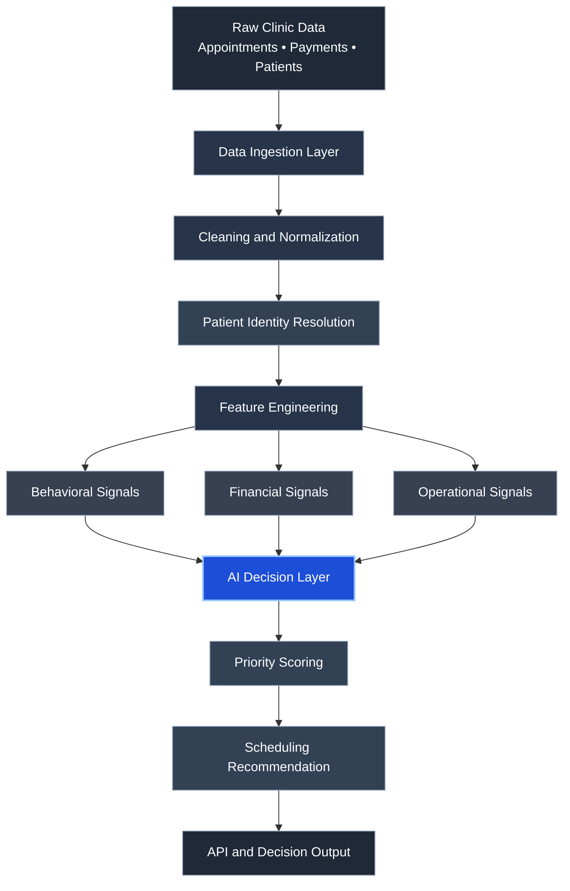
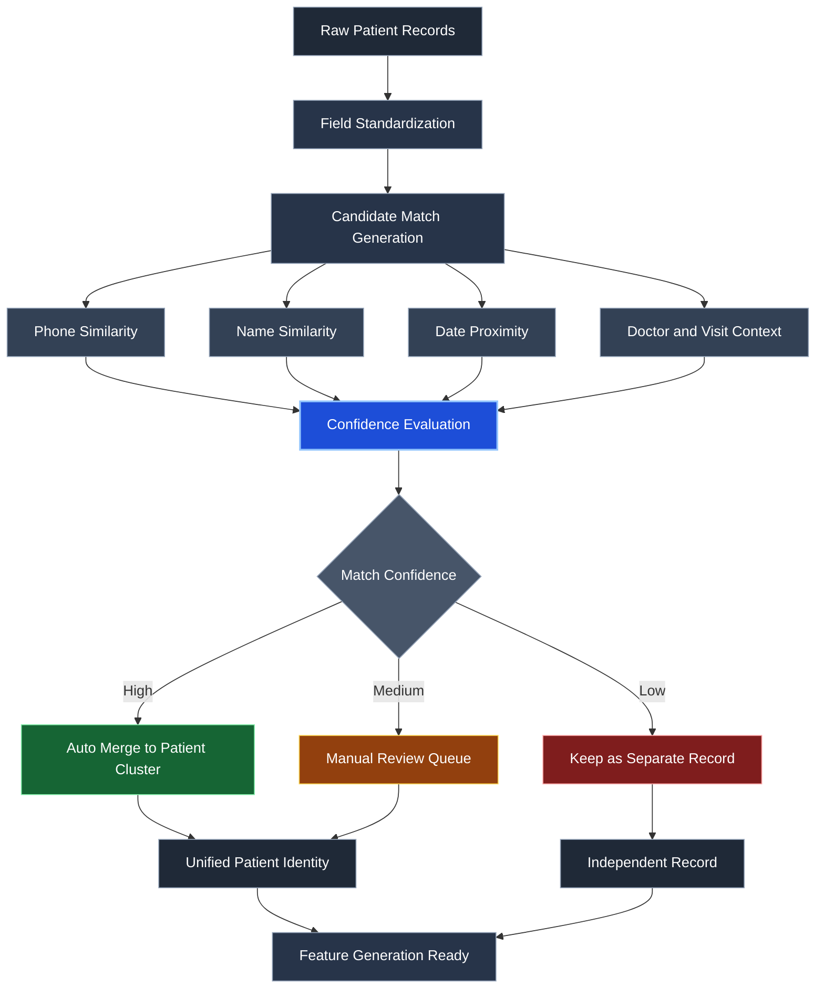

# Atieh AI

## AI-Powered Clinic Intelligence and Value-Based Scheduling System

Atieh AI is a real-world decision intelligence prototype designed to demonstrate how operational clinic data can be transformed into actionable insights through AI-driven analysis.

The system combines patient behavior signals, financial indicators, and operational context to generate intelligent scheduling priorities, support clinic decision-making, and improve overall operational visibility.

---

## Table of Contents

- [Overview](#overview)
- [Problem Statement](#problem-statement)
- [System Capabilities](#system-capabilities)
- [System Architecture](#system-architecture)
- [Patient Identity Resolution Engine](#patient-identity-resolution-engine)
- [Example Workflow](#example-workflow)
- [Technology Stack](#technology-stack)
- [Repository Structure](#repository-structure)
- [Key Features](#key-features)
- [Example Outputs](#example-outputs)
- [Privacy & Data Protection](#privacy--data-protection)
- [Use Cases](#use-cases)
- [Future Development](#future-development)
- [Author](#author)
- [License](#license)

---

## Overview

Healthcare clinics generate large volumes of operational data, including appointments, payments, patient records, and recurring visit patterns. In many real-world clinic environments, this data remains fragmented, inconsistent, or underutilized.

**Atieh AI** is a prototype clinic decision-support system built to demonstrate how AI and data engineering can be used to transform raw operational data into structured, decision-ready intelligence.

The system is designed around four core information layers:

- patient visit history
- financial transaction behavior
- behavioral engagement patterns
- scheduling and operational context

By combining these layers, Atieh AI helps illustrate how clinic data can support smarter prioritization, more informed scheduling, and stronger operational insight generation.

---

## Problem Statement

Many clinics face recurring operational challenges such as:

- inefficient appointment allocation
- weak prioritization of valuable returning patients
- underutilized doctor capacity
- fragmented patient records across operational datasets
- limited visibility into patient retention behavior
- difficulty identifying high-value patient segments

Traditional scheduling systems often treat all visits and all patients the same. As a result, important behavioral, financial, and operational signals are ignored, even though they could meaningfully improve clinic performance.

Atieh AI introduces a **data-driven clinic intelligence layer** designed to support more intelligent scheduling, better prioritization, and stronger operational decision-making.

---

## System Capabilities

### Patient Behavioral Analysis

Analyzes visit frequency, appointment history, and patient return patterns to identify behavioral engagement with the clinic over time.

### Financial Intelligence Layer

Processes payment records and transaction behavior to highlight patients who may represent stronger long-term financial value.

### Value-Based Patient Prioritization

Uses behavioral and financial signals together to support more informed prioritization and better allocation of scheduling capacity.

### Appointment Optimization

Supports improved scheduling decisions by identifying patients more likely to return, continue treatment, or require operational attention.

### Operational Insight Generation

Transforms raw clinic data into interpretable outputs that help decision-makers better understand patient flow, retention signals, and operational patterns.

---

## System Architecture

The system transforms raw clinic records into decision-support outputs through a multi-layer clinic intelligence pipeline.



Each layer contributes to turning raw clinic records into actionable operational intelligence while keeping the overall system architecture modular and extensible.

---

## Patient Identity Resolution Engine

One of the most important technical challenges in clinic data systems is dealing with fragmented and inconsistent patient records. A single patient may appear across multiple files, transactions, or appointment records with slight differences in name formatting, phone structure, date representation, or contextual metadata.

To address this, Atieh AI includes a **multi-signal patient identity resolution layer** that standardizes fields, generates candidate matches, evaluates confidence, and groups related records into a cleaner unified identity structure.



This diagram presents a portfolio-safe abstraction of the identity resolution workflow. The production implementation may include additional internal heuristics, thresholds, and validation rules that are intentionally not exposed in this public repository.

---

## Example Workflow

A typical system workflow looks like this:

1. Import historical clinic data, including appointments, payments, and patient records.
2. Clean and normalize patient-related fields.
3. Resolve or reconcile fragmented patient identities across datasets.
4. Generate behavioral, financial, and operational features.
5. Calculate prioritization indicators and decision-support signals.
6. Produce scheduling recommendations and operational insights.

This workflow reflects how raw clinic data can be progressively transformed into higher-quality decision intelligence.

---

## Technology Stack

The system is implemented using a modern Python-based data engineering and API workflow.

| Component | Technology |
|----------|------------|
| Programming Language | Python |
| API Framework | FastAPI |
| Database | SQLite |
| Data Processing | Pandas |
| Data Input | Excel / CSV |
| Development Environment | Python 3.x |
| Version Control | Git / GitHub |

The architecture is intentionally lightweight, modular, and practical for prototype decision systems and operational clinic intelligence workflows.

---

## Repository Structure

The repository is organized to separate application logic, clinic data processing pipelines, and supporting utilities while keeping the architecture easy to understand for technical reviewers and potential employers.

```text
atieh-ai/
│
├─ README.md
├─ LICENSE
├─ requirements.txt
├─ .env.example
│
├─ app/
│  ├─ main.py
│  ├─ api/
│  ├─ services/
│  └─ models/
│
├─ engine/
│  ├─ scoring_public_stub.py
│  ├─ prioritization_public_stub.py
│  └─ engine_overview.md
│
├─ scripts/
│  ├─ demo_import.py
│  ├─ demo_seed.py
│  └─ smoke_test.ps1
│
├─ docs/
│  ├─ system_architecture.md
│  ├─ workflow.md
│  └─ screenshots/
│
├─ examples/
│  ├─ example_input.xlsx
│  ├─ example_output.json
│  └─ example_report.md
│
└─ tests/
   ├─ test_api.py
   └─ test_pipeline.py
```

---

## Key Features

- AI-driven patient prioritization
- cluster-based identity resolution for fragmented clinic records
- behavioral and financial signal integration
- intelligent scheduling recommendation support
- data normalization pipeline for messy healthcare datasets
- modular architecture for clinic intelligence workflows

---

## Example Outputs

Example system outputs may include:

- patient priority scores
- behavioral visit indicators
- financial tier categorization
- scheduling recommendations
- operational decision-support summaries

Example output format:

```json
{
  "patient_id": 23841,
  "priority_score": 0.82,
  "financial_segment": "HIGH",
  "visit_frequency": "ACTIVE",
  "recommended_action": "high_priority_scheduling"
}
```

These outputs demonstrate how raw clinic data can be transformed into structured, interpretable decision-support signals.

---

## Privacy & Data Protection

This repository is a **sanitized portfolio version** of the system.

To protect privacy and proprietary logic:

- real patient data has been removed
- proprietary scoring algorithms are replaced with public demonstration stubs
- sensitive clinic operational data is excluded
- private business logic is not included
- production-specific heuristics are intentionally abstracted

The purpose of this repository is to demonstrate **system architecture, clinic intelligence design, and engineering approach**, not to expose production algorithms or real patient data.

---

## Use Cases

Potential applications of this system include:

- dental clinics
- private healthcare centers
- outpatient appointment management systems
- patient retention analytics
- operational healthcare intelligence platforms
- value-based clinic scheduling support

The overall architecture can also be adapted to broader healthcare operations optimization scenarios.

---

## Future Development

Potential future improvements include:

- machine learning models for patient behavior prediction
- real-time clinic scheduling optimization
- automated retention and churn detection
- predictive treatment-cycle analysis
- integration with clinic management platforms
- expanded decision support for multi-doctor environments

---

## Author

**Nima Saraeian**  
AI System Builder | Behavioral Data Strategist

Specializing in AI-driven decision systems that combine behavioral analytics, operational data, and intelligent automation.

**GitHub**  
`https://github.com/nimasaraeian`

**LinkedIn**  
Coming soon

---

## License

This repository is released for portfolio and demonstration purposes.

Commercial use, redistribution, or replication of proprietary logic is not permitted without prior permission.

---

This project demonstrates how real-world clinic data can be transformed into intelligent decision systems using modern AI and data engineering practices.
