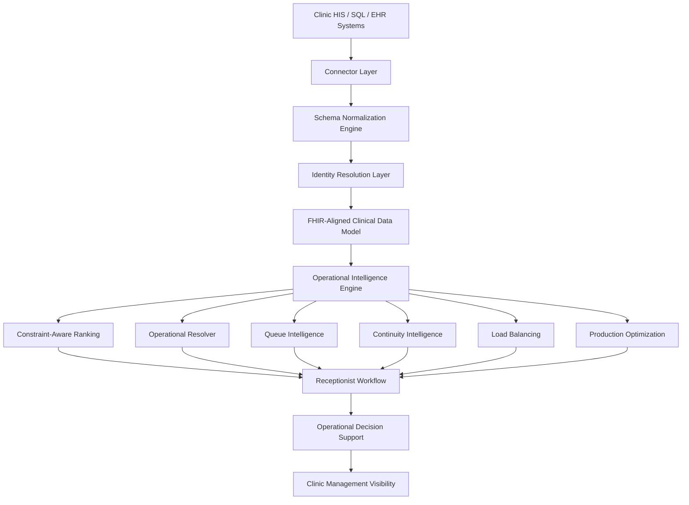

# iQlinic

# AI-Powered Clinical Operations, Scheduling Intelligence & Healthcare Interoperability Platform

Production-ready healthcare operational intelligence platform designed for private clinics, outpatient centers, and multi-doctor healthcare environments.

iQlinic transforms fragmented clinic data into explainable operational intelligence using AI-powered scheduling, continuity-aware doctor recommendation, real-time operational balancing, and healthcare interoperability architecture.

---

# Executive Summary

Modern clinics generate enormous volumes of operational healthcare data every day:

- appointments
- patient records
- doctor schedules
- operational queues
- visit histories
- payment behaviors
- service usage patterns
- continuity relationships
- scheduling interactions

However, in most real-world clinic environments, this data remains:

- fragmented
- operationally disconnected
- inconsistent across systems
- difficult to interpret
- underutilized for decision-making

Traditional clinic software systems mainly function as passive record-management tools.

They store data.

They rarely understand operations.

They rarely optimize workflows.

They rarely provide intelligent operational reasoning.

iQlinic was designed to address this gap.

The platform introduces an AI-powered operational intelligence layer capable of understanding:

- patient continuity
- scheduling conditions
- operational pressure
- doctor load
- behavioral engagement
- queue dynamics
- service compatibility
- workflow constraints

in real time.

Rather than replacing existing HIS or EHR systems, iQlinic connects to operational healthcare infrastructure and transforms raw operational records into explainable operational decision support.

---

# Vision

The long-term vision of iQlinic is to become an AI-native healthcare operational intelligence and interoperability platform capable of:

- understanding fragmented healthcare operational systems
- reducing operational scheduling inefficiencies
- improving continuity of care
- assisting healthcare workflows in real time
- enabling AI-assisted interoperability across heterogeneous healthcare environments
- supporting scalable operational healthcare intelligence across GCC healthcare systems

The platform is intentionally designed around interoperability-first principles and operational realism rather than isolated AI demonstrations.

---

# Real-World Operational Problems

Private clinics and outpatient healthcare centers face recurring operational inefficiencies that traditional software systems rarely solve effectively.

---

# 1. Wrong Doctor Assignment

In many clinics, doctor assignment is still heavily manual.

Receptionists often make scheduling decisions without visibility into:

- patient-doctor continuity
- historical treatment relationships
- doctor workload
- operational pressure
- queue conditions
- overload risk
- service compatibility

As a result:

- continuity of care weakens
- patient satisfaction decreases
- operational imbalance grows
- valuable patients may disengage

---

# 2. Overloaded Doctors & Idle Capacity

Most clinics lack dynamic operational balancing systems.

This creates environments where:

- some doctors become critically overloaded
- some schedules remain underutilized
- queues become unstable
- operational efficiency declines

Traditional appointment systems generally do not include real-time operational load reasoning.

---

# 3. Fragmented Operational Visibility

Clinic managers often lack operational visibility into:

- doctor utilization
- operational bottlenecks
- scheduling pressure
- queue conditions
- continuity trends
- operational efficiency
- overload dynamics

Operational decisions become reactive rather than intelligence-driven.

---

# 4. Fragmented Healthcare Data

Healthcare operational systems frequently contain:

- inconsistent schemas
- duplicated patient records
- fragmented operational identifiers
- multilingual field variations
- legacy database structures
- disconnected operational datasets

This creates major barriers for interoperability and operational intelligence.

---

# The iQlinic Approach

iQlinic introduces a healthcare operational intelligence layer positioned directly inside the clinic workflow.

The platform continuously analyzes operational conditions and generates explainable AI-driven recommendations in real time.

The architecture combines:

- operational AI
- scheduling intelligence
- continuity analysis
- interoperability infrastructure
- queue optimization
- operational balancing
- schema normalization
- identity resolution
- workflow-aware reasoning

inside a unified operational healthcare platform.

---

# Core Platform Capabilities

---

# Intelligent Doctor Recommendation Engine

The doctor recommendation engine dynamically scores and ranks scheduling options using multiple operational dimensions simultaneously.

The system evaluates:

- historical patient-doctor continuity
- doctor affinity
- operational workload
- queue pressure
- overload risk
- service compatibility
- operational scheduling conditions
- fallback safety constraints

Recommendations are explainable and operationally grounded.

The system is designed to support real receptionist workflows rather than isolated AI demos.

---

# Real-Time Operational Load Intelligence

iQlinic continuously monitors operational pressure across clinic environments.

Operational analysis includes:

- doctor occupancy
- queue pressure
- appointment congestion
- overload conditions
- operational traffic patterns
- scheduling saturation
- operational imbalance

Doctor operational states are dynamically classified as:

- healthy
- busy
- overloaded
- critical

This enables real-time operational balancing inside the receptionist workflow.

---

# Patient Continuity Intelligence

Continuity of care is one of the platform's primary operational objectives.

The continuity layer tracks:

- preferred doctor relationships
- historical scheduling patterns
- recurring patient behavior
- treatment continuity
- operational engagement history
- long-term relationship consistency

The goal is to reduce unnecessary doctor switching and improve continuity-aware scheduling behavior.

---

# AI-Powered Scheduling Optimization

The scheduling intelligence engine combines:

- operational constraints
- behavioral signals
- continuity indicators
- doctor load
- queue conditions
- service requirements
- operational pressure
- scheduling availability

to generate operationally balanced recommendations.

The platform focuses on operational realism rather than simplistic slot recommendation logic.

---

# Operational Decision Support

iQlinic transforms fragmented clinic records into structured operational intelligence outputs including:

- scheduling recommendations
- patient operational prioritization
- continuity indicators
- operational load visibility
- queue analysis
- doctor utilization summaries
- operational pressure alerts
- workflow optimization insights

---

# Healthcare Interoperability Architecture

iQlinic is designed around an interoperability-first operational architecture.

The platform includes a FHIR-aligned operational data model intended to support:

- HL7 FHIR R4 workflows
- multi-clinic operational integration
- future Ministry-level interoperability
- schema normalization
- connector-based healthcare ingestion
- AI-assisted interoperability workflows

The architecture is intentionally modular and extensible.

---

# AI-Assisted Schema Intelligence

Real-world healthcare systems rarely share identical schemas.

Different healthcare systems may use:

- different SQL structures
- inconsistent field naming
- legacy operational databases
- fragmented operational identifiers
- multilingual schema conventions
- customized healthcare workflows

To reduce integration friction, iQlinic includes a schema intelligence layer capable of:

- field normalization
- operational mapping
- semantic schema interpretation
- configurable connector templates
- AI-assisted schema matching
- operational data standardization

The platform is designed to progressively evolve toward semi-autonomous interoperability onboarding.

---

# Patient Identity Resolution Engine

Healthcare operational environments frequently contain fragmented patient identities.

The same patient may appear across operational systems using:

- inconsistent names
- duplicated records
- fragmented operational identifiers
- formatting differences
- multilingual variations
- disconnected visit histories

iQlinic includes a multi-signal identity resolution engine designed to:

- standardize operational fields
- generate candidate identity matches
- evaluate confidence levels
- cluster related operational records
- build cleaner operational identities
- reduce fragmentation before AI processing

The identity layer combines:

- phone similarity
- name similarity
- contextual operational matching
- visit proximity
- doctor continuity
- behavioral consistency
- operational metadata analysis

to improve operational integrity before scheduling intelligence is applied.

---

# System Architecture



---

# Operational AI Layers

The platform currently includes multiple operational intelligence modules validated in real-world clinic environments.

---

## Constraint-Aware Ranker V3

Scores doctors dynamically using:

- continuity
- affinity
- operational load
- queue pressure
- overload penalties
- operational scheduling conditions

---

## Operational Resolver V4

Balances operational conditions in real time while applying fallback-safe operational logic.

---

## Patient Continuity Engine V1

Tracks:

- preferred doctors
- recurring scheduling behavior
- operational continuity
- long-term patient relationships

---

## Queue & Load Balancer V1

Provides operational awareness for:

- healthy
- busy
- overloaded
- critical

doctor states.

---

## Production Optimization Layer V1

Produces final explainable operational recommendations including:

- strong_recommend
- continuity_preferred
- operational_recommend
- overload_avoidance
- fallback_safe

---

# Production Validation Status

The platform has undergone operational validation inside live clinic environments.

Current validation status includes:

- 1M+ real clinic visits analyzed
- live HIS-connected operational environment
- shadow-mode deployment validation
- real receptionist workflow testing
- operational stress testing
- multilingual workflow validation
- operational AI layer testing
- production-safe deployment architecture

---

# Example Operational Workflow

1. Connect clinic HIS or SQL infrastructure.
2. Import operational healthcare records.
3. Normalize fragmented operational data.
4. Resolve patient operational identities.
5. Generate behavioral and operational features.
6. Evaluate scheduling conditions.
7. Score operational recommendation scenarios.
8. Generate explainable AI recommendations.
9. Deliver operational visibility to receptionists and clinic managers.

---

# GCC Healthcare Strategy

iQlinic is strategically designed for GCC healthcare environments.

Current regional focus includes:

- Oman pilot deployment strategy
- UAE expansion readiness
- Saudi enterprise scalability
- Arabic-first operational workflows
- RTL-ready operational interfaces
- multilingual deployment support
- interoperability-oriented healthcare infrastructure

---

# Why GCC

The GCC healthcare ecosystem presents strong operational AI opportunities due to:

- rapid healthcare digitization
- fragmented operational workflows
- increasing private clinic density
- operational inefficiency
- Ministry-level modernization initiatives
- FHIR adoption momentum
- growing interoperability requirements

---

# Technology Stack

| Layer | Technology |
|---|---|
| Backend API | FastAPI |
| Operational AI | Python |
| Frontend | React + Vite |
| Database | SQLite / SQL Server |
| Data Processing | Pandas |
| Interoperability | FHIR-aligned architecture |
| Deployment | Desktop + Web |
| Infrastructure | Connector-based operational architecture |
| Version Control | Git / GitHub |

---

# Repository Structure

```text
iqlinic/
│
├── app/
├── engine/
├── ai_layers/
├── scheduling/
├── interoperability/
├── normalization/
├── identity_resolution/
├── connectors/
├── frontend/
├── deployment/
├── docs/
├── examples/
├── tests/
└── scripts/
```

---

# Privacy & Data Protection

This public repository is a sanitized and portfolio-safe representation of the platform.

To protect operational privacy and proprietary infrastructure:

- no real patient data is included
- production operational heuristics are abstracted
- sensitive deployment logic is excluded
- proprietary optimization rules are not exposed
- operational infrastructure details are intentionally limited

The repository is intended to demonstrate:

- operational healthcare architecture
- interoperability direction
- AI system engineering
- workflow intelligence design
- healthcare operational reasoning

without exposing sensitive production infrastructure.

---

# Future Direction

Planned platform evolution includes:

- AI-assisted interoperability onboarding
- semi-autonomous schema mapping
- cross-clinic operational learning
- predictive scheduling optimization
- operational forecasting
- enterprise healthcare interoperability
- multi-clinic orchestration
- operational intelligence networks
- self-improving mapping infrastructure
- healthcare workflow optimization at scale

---

# Author

## Nima Saraeian

AI Systems Builder  
Healthcare Operational Intelligence  
Behavioral & Decision Systems

GitHub:
https://github.com/nimasaraeian

---

# License

This repository is provided for architecture review, portfolio demonstration, and operational healthcare AI presentation purposes only.

Commercial redistribution, replication of proprietary operational logic, or unauthorized deployment is prohibited without explicit permission.

---

# Final Note

iQlinic demonstrates how fragmented healthcare operational data can be transformed into explainable, workflow-aware operational intelligence systems using modern AI, interoperability-driven architecture, and operational healthcare reasoning.

The platform is intentionally designed around real-world clinic workflows, operational realism, and scalable interoperability principles rather than isolated AI demonstrations.